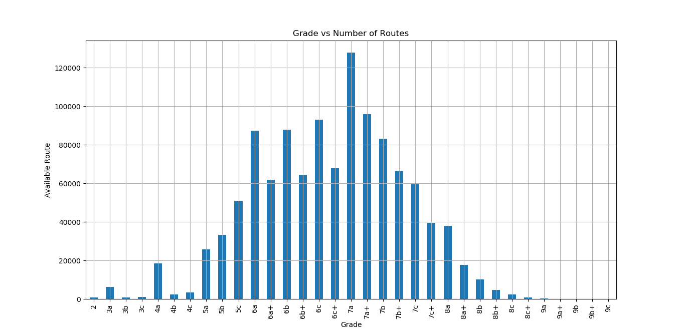
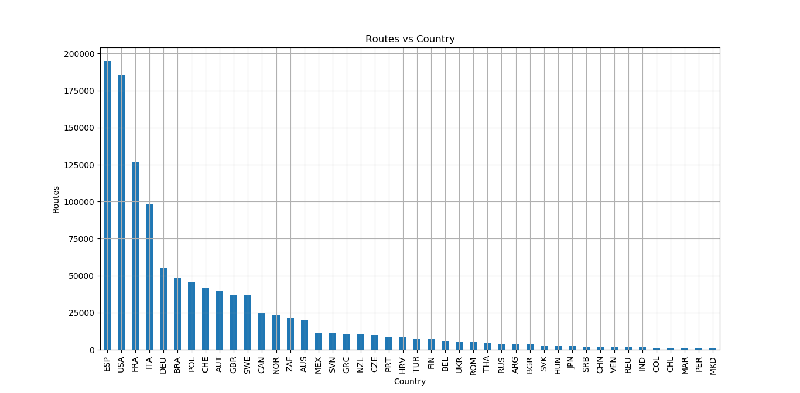
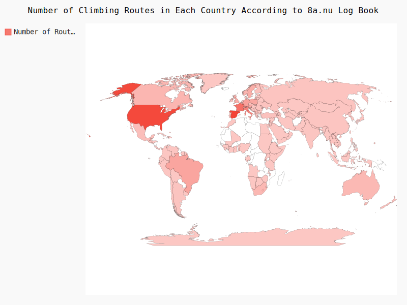
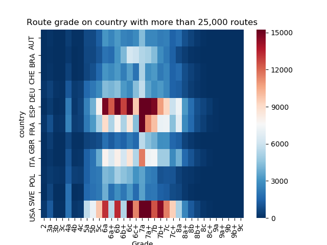
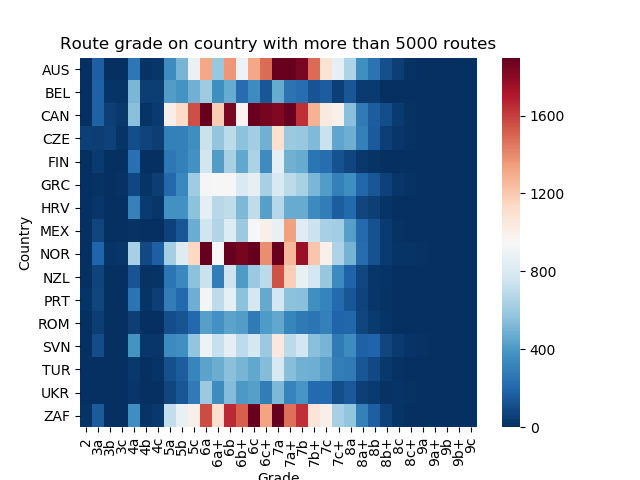
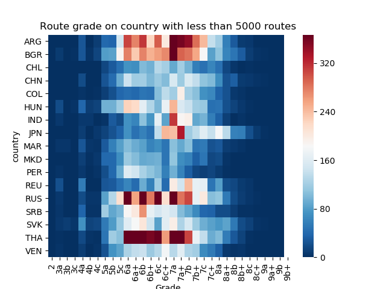
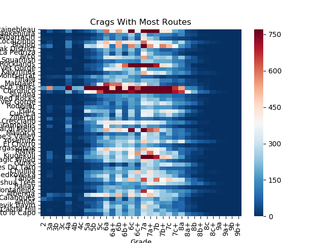
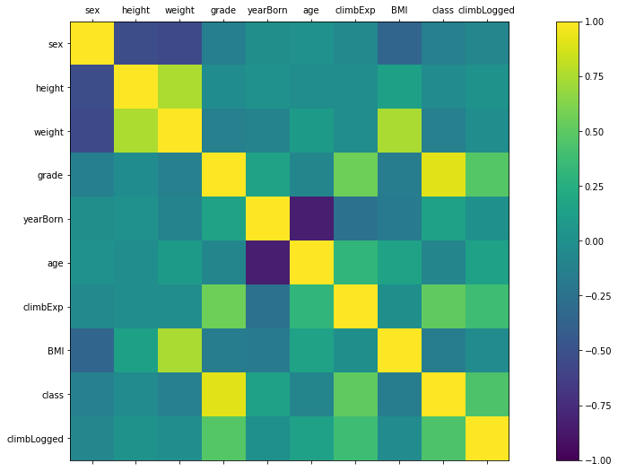
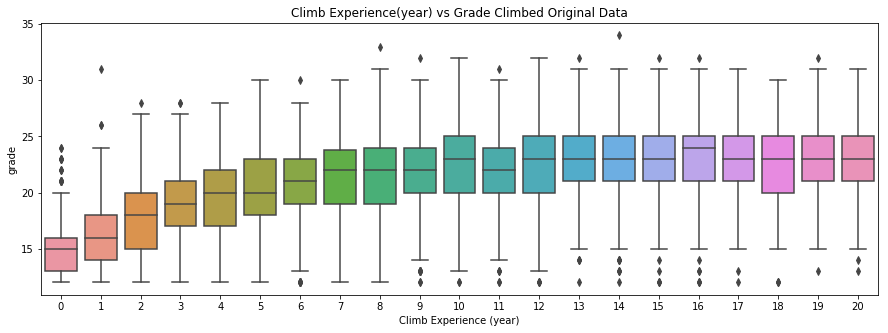
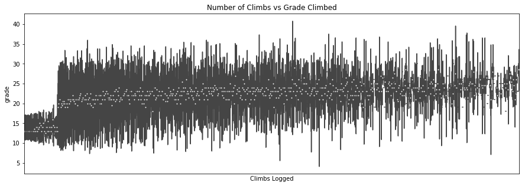

##Data Visualization of 8a.nu Database
Dataset from [David Cohen's Kaggle](https://www.kaggle.com/dcohen21/8anu-climbing-logbook)
From the dataset, I extracted the route name, crag name, sector, country and the climbing grade of the route.

```
data = sqlite3.connect('database.sqlite')
cur = data.cursor()
query = cur.execute('select ascent.year, ascent.name, ascent.crag, ascent.sector, ascent.climb_type, ascent.country, grade.fra_routes from ascent, grade where ascent.grade_id = grade.id')
cols = [column[0] for column in query.description]
df = pd.DataFrame.from_records(data=query.fetchall(), columns = cols)
```
The dataset have "climb type" column that categorize the climb as a boulder or lead climbing but the data is not quite accurate so I decided to not include the climb categorization.
Second graph is a Barchart that shows number of climbing by their grades that have been logged

Second graph is a Barchart of countries with most routes available to climb.

Map of route logged in each country

Because there is a huge gap on number of routes logged in each country, I split the data into country with more than 25,000 route, country with more than 5,000 route, and country with less than 5,000 route. Below is the heatmap.



Last chart is a heatmap that shows number of route according to their grade in crags with the most routes logged.


## User Classification

Added user classification with Logistic Regression based on this dataset based on correlations from user data

Best correlation to grades are with climbing experience and number of climbs logged, here are the box plot of both variables against grade


Classification method is with accuracy of 60-65%, there are more variables required to get accurate results like the user training schedule and intensity which I think will have the biggest correlation to grades

